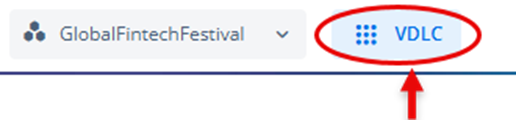

# Accessing Theme Modules
You can access the Theme module by using the VDLC icon. After you access the Theme module, the Vahana cloud portal displays the Themes page. The Themes page displays a record of the default theme, which is named Vahana Theme. On the Themes page, you can do one of the following: 
* Use the default theme with default color settings, typography, and styles
* Use the default theme with custom color settings, typography, and styles
* Use a custom theme with custom color category and settings, custom typography, and styles

To access the Theme module:
1. On the Vahana cloud portal’s dashboard, see the top panel.
2.	In the top panel, see the **VDLC** icon() to the right of the workspace name. 

3.	Click the **VDLC** icon and then go to **Design & Architecture** Themes.
4.	Under **Design & Architecture**, click **Themes** to display the **Themes** page.

