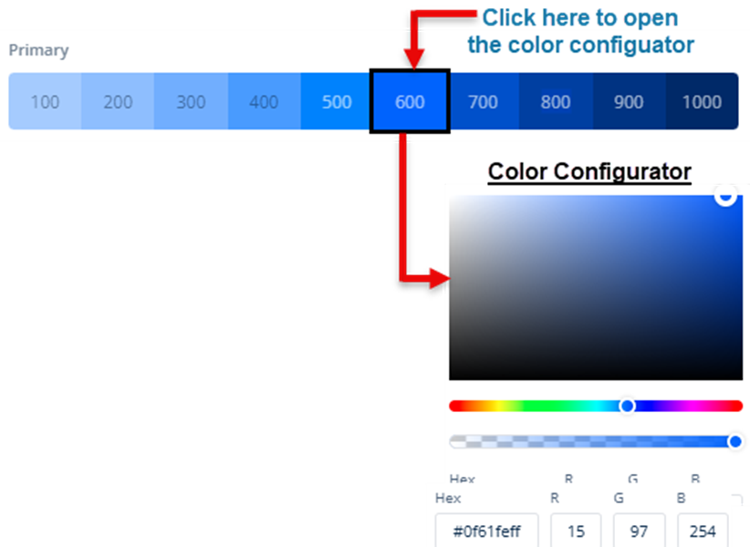

# Selecting New Color and Typography
In the **Quick Theme Setup** dialog box, you can define a custom color in the predefined category as follows:

To define a new color:
1.	In a predefined category (for example, **Primary**), click the selected box to open the color configurator.

2.	In the color configurator, you can define a new color as follows:
    * On the canvas, move the circle to define the color tone of the selected color
    * On the upper bar ( ), move the circle to select the color (for example, **light blue**).
    * On the lower bar (), move the circle to define the transparency of the selected color.

>**Note**:- _When you move the circle on the color canvas, upper bar, or lower bar, the color configurator box dynamically displays the changeable hexadecimal values and RGB codes of colors. You can also use the hexadecimal value or RGB codes of the selected color in other themes._

3.	After you select a color in the predefined category, click **Next** to display the Primary Font Family box.
4.	Click the **Primary Font Family** box to select the font (for example, **Aleo**) that you want to use in the theme.
5.	After you select the color and primary font of a new theme, click **Save** to create a new theme.

After you click **Save** in the **Quick Theme Setup** dialog box, the **Themes** module displays the **Colors** dashboard. You can also access the **Colors** dashboard by clicking the **Colors** menu in the left panel on the **Themes** page.
