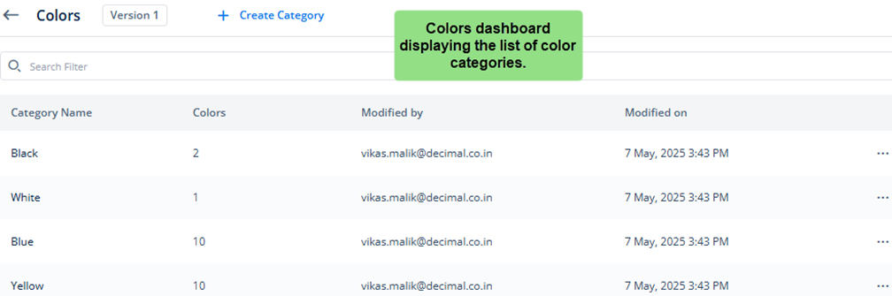

# Accessing Color Sub-module
To access the Colors submodule, see the list of available themes on the **Themes** page. In the list of themes, double-click the name (for example, **Demo_Theme1**) of the theme that you want to access. After you double-click the name of the theme, it displays the **Colors** dashboard.

If you created a custom color category earlier, the **Colors** dashboard will display the custom category in addition to the list of predefined categories.