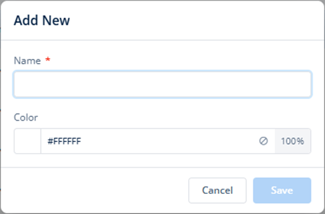
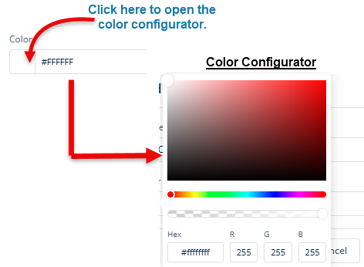
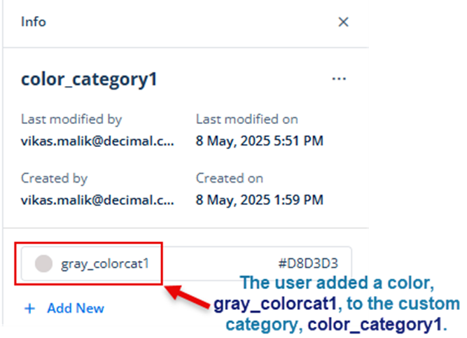

# Adding Color to Category
On the **Colors** page, you can define custom colors under a predefined color category or a custom color category. While creating a theme, you can choose a predefined category or a custom category to add a custom color or a set of custom colors. Choosing a color category and using the predefined color or custom color depends on the following factors:
* **Theme-specific requirements**
* **Design-centric requirements of an application**

To add a new color to the category:
1.	On the **Colors** page, under **Category Name**, find a category (for example, **color_category1**) to add a color to it.
2.	After you find the category (for example, **color_category1**), click its name to display the **Info** panel.
3.	In the **Info** panel, click **Add New** to display the **Add New** dialog box.

4.	In the **Add New** dialog box, enter the name of the color (for example, **gray_colorcat1**).
5.	In the **Color** box, you can define the color as follows:

>**Procedure1:- (By using the color configurator)**
6.	In the **Color** box, click the left section to display the color configurator.

7.	In the color configurator, define a color as follows:
    * On the canvas, move the circle to define the color tone (shade of color) of the selected color.
    * On the upper bar ( ), move the circle to select the color (for example, **light gray**).
    * Click outside the configurator to select the color.

>**Procedure2:- (By entering a hexadecimal code) (From Step5)**
8.	In the **Color** box, click in the middle section and then enter the hexadecimal value (for example,**#d8d3d3**) of the color.
9.	In the **Color** box, click the right section to define the opacity of the color as follows:
    * 100% value means that the color is fully opaque.
    * 0% value means that the color is fully transparent.
10.	After you select the color and define its opacity, click **Save** to add the color to the color category.

