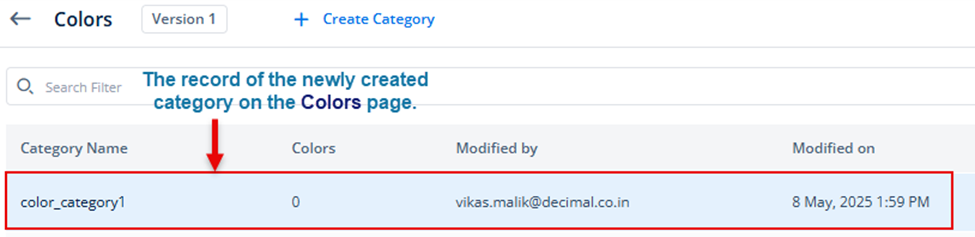

# Adding a New Custom Color
If you want to use a custom color category to design a new theme for the application, you need to create a new color category.

To create a new color category:
1.	On the **Colors** dashboard, see the top panel.
2.	In the top panel, click **Create Category** to display the **Create Category** dialog box.
3.	In the **Create Category** dialog box, in the **Name** box, enter the name (for example, **color_category1**) of the category, and then click **Create** to create a new category.

After you successfully create a new category, the Colors page starts displaying its record.

